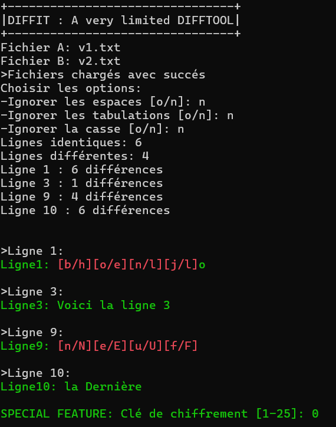

# DIFFIT: un outil très simplifié de "diff"

Voici de quoi s’entraîner pour le test pratique

## Mission
Compléter les **TODO** de [Program.cs](Program.cs) en utilisant les fichiers examples [v1.txt](v1.txt) et [v2.txt](v2.txt).

### Démo
- [Télécharger la démo autonome](https://eduvaud.sharepoint.com/:u:/s/ETML_INF_MAITRES_Teams/EYlYJ6FNaFNCtDvxyanH17UB6a5BeJWOjR5z0vkz-wpDrQ?e=Ph38Jh)

OU

- [Utiliser l’éxécutable dépendant du framework (depuis votre poste seul.)](binary/diffit.exe)

## Aide
- [Cheatsheet](../../supports/linq-cheatsheet.pdf)
- notes de cours
- [Exercices précédents](../../exos/words/)exercices précédents
- dépôt local du cours
