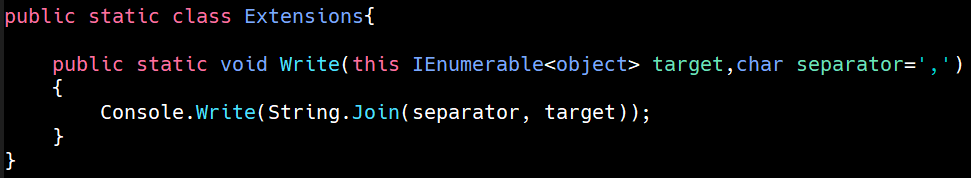
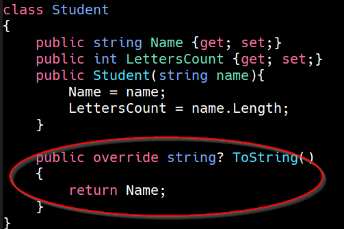

# SWAPI

Enfilez vos combinaisons, nous partons dans l'hyper-espace !!!

Première étape: [là](https://swapi.dev/)

Vous avez compris de quoi il s'agit ? Alors ... à vous jouer!


## Planète 0
Avant d’attaquer les exercices suivants, autant profiter de la [théorie sur les extensions](../../supports/source/05-Extension.md) pour se faciliter la tâche.

### Affichage "magique"

Jusqu’à maintenant, pour afficher le contenu retourné par un filtre ou une transformation, il fallait passer par

#### Actuel

``` csharp
result.ToList().ForEach(item=>Console.WriteLine(item));
```

ou bien

``` csharp
Console.WriteLine(String.Join(result.Select(item=>item.X)));
```

Bref c’est *fastidieux*...

#### Objectif
Idéalement, on voudrait juste écrire quelquechose comme:

``` csharp
result.Write();
```

##### Étapes
1. Créer une classe publique statique nommée Extension (nom libre)
2. Ajouter une méthode statique ne retournant rien et nommée ‘Write’
3. Ajouter un argument de type IEnumerable idéalement compatible avec tout type

#### Implémentation
Voici une version possible:



> Ceci implique que les objets (classes) utilisées doivent avoir une méthode ‘toString’ pertinente, comme par exemple ci-dessous:




## Planète 1

En vous aidant **uniquement** de ce site et de votre documentation personnelle (en d'autre termes **sans aucun recours** à une IA), écrivez un programme qui donne les réponses aux questions suivantes:

1. Quel est le film Star Wars dont le titre est le plus long ?
2. Quel est le personnage qui est présent dans le plus de films ?
3. Quelle est la planète la plus peuplée ?
4. Combien de starfighter X-Wing est-ce que je peux m'acheter si je vends un Star Destroyer ?
5. Est-ce qu'Obi-wan Kenobi peut piloter un Millennium Falcon ?
6. Quelle est le vaisseau le plus rapide en vitesse lumière (vmax = vitesse atmosphérique max * ratio hyperespace) ?
7. Combien de vaisseaux sont plus rapides que la moyenne de la vitesse atmosphérique de tous les vaisseaux ?
8. Quel est le budget nécessaire (en franc suisse (1 crédit = 0.778 CHF)) à l’achat de la flotte totale ?
9. Générer un CSV (vaisseau.txt) contenant les infos suivantes des vaisseaux : 
   - Nom du vaisseau
   - Prix
   - Longueur
   - Films dans lesquels ils apparaissent (nom des films en minuscule séparés par des tirets)
   - Nom des planètes survolées (nom des planètes en minuscule séparées par des tirets)

Vous n'allez pas implémenter toutes ces questions. Faites-en le plus possible en 45 minutes, en choisissant celles qui vous semblent les plus pertinentes à pratiquer en vue d’un test futur...

## Planète 2

Créer un programme en mode console qui:

  - Demande à l'utilisateur d'introduire un titre de film de l’univers SW
  - Retrouve le film voulu en calculant la [distance de Levenshtein](https://fr.wikipedia.org/wiki/Distance_de_Levenshtein) avec chaque film de SWAPI. Etablir une valeur de cette distance au delà de laquelle on estime qu'on n'a pas reconnu le titre.
  - Ecrit le "contenu de l'affiche" du film trouvé: 
    - Titre
    - synopsis
    - durée
    - Acteurs
	
### Aide
- [https://gist.github.com/Davidblkx/e12ab0bb2aff7fd8072632b396538560](https://gist.github.com/Davidblkx/e12ab0bb2aff7fd8072632b396538560)
- [https://github.com/Turnerj/Quickenshtein](https://github.com/Turnerj/Quickenshtein)

## Planète 3

Emmenez votre programme dans une autre galaxie: le Web!

Au lieu de rendre un résultat sous forme de texte, générez un fichier `.html`.

Servez-vous de [ce fichier](./billboard.html) comme base de travail, injectez vos données au bons endroits. Pour les images, prenez [celle-cis](./sw-affiches.zip).

Votre programme doit ouvrir le fichier résultant dans votre navigateur.

### Aide
- [Lancer un processus avec c#](https://learn.microsoft.com/en-us/dotnet/api/system.diagnostics.process?view=net-9.0)
- Sur windows, la commande ‘open’ suivie d’une URL lance automatiquement un navigateur vers l’adresse...

## Planète 4

Pas de film Star Wars sans le fameux texte d'introduction dans l'espace.

Récupérez le `opening_crawl` du film, mettez-le dans [index.html](./crawler/index.html) et lancez-le !
