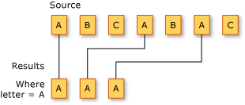

# Fonction Filter

La fonction filter est un concept important en programmation qui permet de sélectionner des éléments d'une collection en fonction d'une condition spécifique.

## Définition

La fonction filter est une fonction qui prend deux arguments :

* Une collection (par exemple, une liste, un tableau, un ensemble, etc.)
* Une condition (par exemple, une fonction, un lambda, un expression, etc.)

La fonction filter retourne une nouvelle collection qui contient les éléments de la collection originale qui répondent à la condition.



## Exemples basiques

#### Exemple 1 : Filtrage d'une liste de nombres

```csharp
List<int> numbers = new List<int> { 1, 2, 3, 4, 5, 6, 7, 8, 9, 10 };
List<int> evenNumbers = numbers.Where(x => x % 2 == 0).ToList();
```

Dans cet exemple, la fonction filter est utilisée pour récupérer les nombres pairs d'une liste de nombres.

#### Exemple 2 : Filtrage d'une liste de personnes

```csharp
List<Person> people = new List<Person> {
    new Person { Name = "John", Age = 25 },
    new Person { Name = "Mary", Age = 30 },
    new Person { Name = "Jane", Age = 20 },
    new Person { Name = "Bob", Age = 35 }
};

List<Person> adults = people.Where(p => p.Age >= 18).ToList();
```

Dans cet exemple, la fonction filter est utilisée pour récupérer les personnes adultes d'une liste de personnes.

#### Exemple 3 : Filtrage d'une liste de chaine de caractères

```csharp
List<string> words = new List<string> { "hello", "world", "abc", "def", "ghi" };

List<string> wordsStartingWithA = words.Where(w => w.StartsWith("a")).ToList();
```

Dans cet exemple, la fonction filter est utilisée pour récupérer les mots qui commencent par "a" d'une liste de mots.

## Filtrages avancés
Au cas où cela ne coulerait pas de source avec ce qui a été présenté sur les fonctions d’ordre supérieur, il est intéressant de noter que les filtres peuvent être combinés soit directement avec des opérateurs de LINQ ou alors avec n’importe quelle expression du langage C# avec une fonction dédiée.

### 3 différentes manières de filtrer avec plusieurs critères
```csharp
numbers.Where(n => n > 2).Where(n => n % 2 == 0); // 2 where chaînés en lambda

numbers.Where(n => n > 2 && n % 2 == 0); //condition avec && logique en lambda

//version avec une fonction complète
numbers.Where(n => { 
    return n>2 && n % 2 == 0;
});
```

## Avantages et inconvénients

La fonction filter offre plusieurs avantages, notamment :

* **Flexibilité** : La fonction filter permet de créer des filtres complexes en utilisant des conditions logiques et des fonctions.
* **Réutilisation** : La fonction filter peut être utilisée avec différentes collections et conditions.
* **Simplification** : La fonction filter peut simplifier le code en permettant de regrouper des opérations complexes en une seule fonction.

En contrepartie, elle a l’inconvénient de pouvoir être plus difficile à relire lorsqu’on revient à froid sur le projet...

## Comparaison avec le javascript
En javascript, le concept de *filter* s’appelle même du même nom...

Voici, à titre d’exemple, quelques snippets en javascript.

### Exemple 1 : Filtrage d'un tableau de nombres

```javascript
const numbers = [1, 2, 3, 4, 5, 6, 7, 8, 9, 10];
const evenNumbers = numbers.filter(x => x % 2 === 0);
console.log(evenNumbers); // [2, 4, 6, 8, 10]
```

Dans cet exemple, la fonction filter est utilisée pour récupérer les nombres pairs d'un tableau de nombres.

### Exemple 2 : Filtrage d'un tableau de personnes

```javascript
const people = [
  { name: "John", age: 25 },
  { name: "Mary", age: 30 },
  { name: "Jane", age: 20 },
  { name: "Bob", age: 35 }
];

const adults = people.filter(p => p.age >= 18);
console.log(adults); // [{ name: "John", age: 25 }, { name: "Mary", age: 30 }, { name: "Bob", age: 35 }]
```

Dans cet exemple, la fonction filter est utilisée pour récupérer les personnes adultes d'un tableau de personnes.

### Exemple 3 : Filtrage d'un tableau de chaine de caractères

```javascript
const words = ["hello", "world", "abc", "def", "ghi"];

const wordsStartingWithA = words.filter(w => w.startsWith("a"));
console.log(wordsStartingWithA); // ["abc"]
```

## Évaluation Paresseuse (Deferred Execution)

L'une des caractéristiques les plus importantes de LINQ — et de la programmation fonctionnelle
en général — est l'**évaluation paresseuse** (ou *deferred execution*).

### Qu'est-ce que c'est ?

Quand tu écris `numbers.Where(n => n > 5)`, LINQ ne filtre *pas* les données à cet instant.
Il *décrit* ce qu'il faudra faire, et reporte l'exécution au moment où les données sont
réellement demandées.

```csharp
List<int> numbers = new() { 1, 2, 3, 4, 5 };

var query = numbers.Where(n => n > 2); // Rien n'est filtré — juste une description

numbers.Add(10);     // Modification de la source APRÈS construction de la query
numbers.Add(15);

var result = query.ToList(); // Exécution ICI — 3, 4, 5, 10, 15 (les nouveaux sont inclus !)
```

> Le pipeline n'est *exécuté* que quand on **matérialise** le résultat :
> `ToList()`, `ToArray()`, `Count()`, `First()`, une boucle `foreach`, etc.

### Comment savoir si une opération est paresseuse ?

En règle générale :
- **Paresseux** (retourne `IEnumerable<T>`) : `Where`, `Select`, `OrderBy`, `GroupBy`, `Skip`, `Take`...
- **Immédiat** (force l'exécution) : `ToList()`, `ToArray()`, `Count()`, `Sum()`, `First()`, `Any()`...

```csharp
// Ceci ne fait RIEN (pipeline paresseux, rien ne consomme le résultat)
numbers.Where(n => n > 2).Select(n => n * 2);

// Ceci exécute le pipeline
var result = numbers.Where(n => n > 2).Select(n => n * 2).ToList();
```

### Interaction avec les closures

La combinaison évaluation paresseuse + closures peut produire des résultats inattendus :

```csharp
int threshold = 5;
var query = numbers.Where(n => n > threshold); // Capture threshold par référence

threshold = 1; // Modification APRÈS construction de la query

var result = query.ToList(); // Exécution — utilise threshold=1, pas threshold=5 !
// Résultat : tous les nombres > 1 (pas > 5 comme on aurait pu le croire)
```

> Ce comportement n'est pas un bug — c'est la conséquence logique de deux mécanismes
> cohérents. La comprendre évite des heures de débogage.

## `Any` et `All` — Prédicats HOF Booléens

`Any` et `All` sont des **fonctions d'ordre supérieur sur des booléens** — des agrégateurs
qui réduisent une collection à un seul booléen selon un prédicat.

```csharp
List<int> numbers = new() { 1, 2, 3, 4, 5 };

// Any : y a-t-il AU MOINS UN élément qui satisfait le prédicat ?
bool hasEven  = numbers.Any(n => n % 2 == 0);   // true — il y a 2 et 4
bool hasNeg   = numbers.Any(n => n < 0);          // false

// All : TOUS les éléments satisfont-ils le prédicat ?
bool allPos   = numbers.All(n => n > 0);           // true
bool allEven  = numbers.All(n => n % 2 == 0);      // false

// Any sans prédicat : la collection est-elle non vide ?
bool notEmpty = numbers.Any();                      // true
```

### Any et All comme cas particuliers de Fold

`Any` et `All` sont en réalité des `Aggregate` (Fold) sur des booléens :

```csharp
// Any(pred) = Fold avec ||
bool anyEven = numbers.Aggregate(false, (acc, n) => acc || n % 2 == 0);

// All(pred) = Fold avec &&
bool allPositive = numbers.Aggregate(true, (acc, n) => acc && n > 0);
```

> Cette équivalence révèle que `Any`, `All`, `Sum`, `Count`, `Max` ne sont pas des
> opérations "spéciales" — ce sont toutes des instanciations du même Fold universel.

# Conclusion

La fonction filter est un concept important en programmation qui permet de sélectionner des éléments d'une collection en fonction d'une condition spécifique. Les exemples ci-dessus montrent comment utiliser la fonction filter en C# (et en javascript) pour filtrer des données.

## *Source*

Inspiré de 

- https://learn.microsoft.com/en-us/dotnet/csharp/linq/standard-query-operators/filtering-data
- [groq ai inference](https://groq.com/) avec le prompt suivant :
```text
théorie sur la fonction filter de manière générale et exemples en C# pour programmeurs avancés et en 800 mots maximum
```